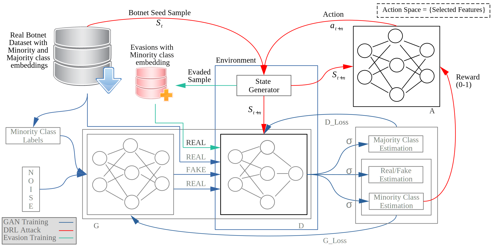

# Deep Reinforcement Learning based Evasion Generative Adversarial Network for Botnet Detection




## Prerequisites
* Tensorflow
* Keras
* Numpy
* For the rest of the packages please refer to header.py file inside the project directory.


## Cite this Work
```
Randhawa, Rizwan Hamid, et al. "Deep Reinforcement Learning based Evasion Generative Adversarial Network for Botnet Detection." arXiv preprint arXiv:2210.02840 (2022).
```
### Bibtex
```
@misc{https://doi.org/10.48550/arxiv.2210.02840,
  doi = {10.48550/ARXIV.2210.02840},
  
  url = {https://arxiv.org/abs/2210.02840},
  
  author = {Randhawa, Rizwan Hamid and Aslam, Nauman and Alauthman, Mohammad and Khalid, Muhammad and Rafiq, Husnain},
  
  keywords = {Cryptography and Security (cs.CR), Artificial Intelligence (cs.AI), FOS: Computer and information sciences, FOS: Computer and information sciences},
  
  title = {Deep Reinforcement Learning based Evasion Generative Adversarial Network for Botnet Detection},
  
  publisher = {arXiv},
  
  year = {2022},
  
  copyright = {Creative Commons Attribution 4.0 International}
}


```